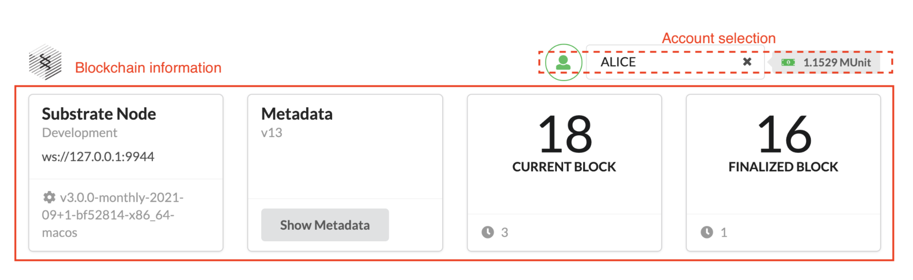

> [!WARNING]
> Some links are broken, support is on the way.

As you learned in [Blockchain Basics](../learn/blockchain-basics.md), a blockchain consists of decentralized computers—called nodes—that form a network.

Substrate provides a flexible, open, and extensible development environment that allows you to design and build fully customized blockchain nodes to suit your application or business model needs.

## Get Started

The first step in becoming a blockchain developer is to learn how to compile and launch a single local blockchain node. In this tutorial, you'll build and start a single-node blockchain using the **Substrate Node Template**.

The Substrate Node Template provides a working single-node blockchain that you can run locally in your development environment. It includes predefined components—such as user accounts and account balances—so you can experiment with common tasks. Without any modifications, you can run a functional node that produces blocks and allows transactions.

After starting the local blockchain node, this tutorial will show you how to use a Substrate front-end template to view blockchain activity and submit a transaction.

### Who Is This Tutorial For?

This tutorial is a basic introduction to Substrate and prepares a minimal working development environment for further exploration. It is designed for anyone interested in learning about Substrate and blockchain development, with no prior experience required. This is just the first step, but it aims to inspire you to continue your journey.

### How Much Time Do You Need?

This tutorial involves compiling Rust code and takes approximately **1 to 2 hours** to complete.

## Before You Begin

For this tutorial, you'll download and use working code. Before starting, verify the following:

- You have a good internet connection and access to a shell terminal on your local computer.
- You are familiar with software development and command-line interfaces.
- You have a basic understanding of blockchains and smart contract platforms.
- You have installed Rust and set up your development environment as described in [Install](/install/).

## Tutorial Objectives

By completing this tutorial, you will:

- Compile the Node Template and start a local Substrate-based blockchain.
- Install a front-end template to interact with the local blockchain node.
- Use the front-end template to submit a transaction and view the result.

## Compile a Substrate Node

The [Substrate Node Template](https://github.com/substrate-developer-hub/substrate-node-template) provides a working development environment, allowing you to start building on Substrate immediately.

If you've already compiled the Node Template on your local computer, skip this section and proceed to [Start the Local Node](#start-the-local-node).

To compile the Substrate Node Template:

1. Open a terminal shell on your computer.
2. Clone the Node Template repository by running:

```bash
git clone https://github.com/substrate-developer-hub/substrate-node-template
```

This command clones the `main` branch. If you want to work with a specific Polkadot version, use the `--branch` option to select the desired branch.

Check [Releases](https://github.com/paritytech/polkadot/releases) or [Tags](https://github.com/paritytech/polkadot/tags) for the latest Polkadot branches compatible with the Node Template.

3. Navigate to the root of the Node Template directory:

```bash
cd substrate-node-template
```

   Create a new branch for your work:

```bash
git switch -c my-learning-branch-yyyy-mm-dd
```

Replace `yyyy-mm-dd` with identifying information, such as the current date (e.g., `2023-03-01`).

4. Compile the Node Template with:

```bash
cargo build --release
```

Always use the `--release` flag for optimized builds. The first compilation may take some time.

Upon completion, you should see:

```bash
Finished release [optimized] target(s) in 11m 23s
```

## Start the Local Node

Once your node is compiled, you can start exploring its functionality using the front-end template.

To start the local Substrate node:

1. In the same terminal, start the node in development mode:

```bash
./target/release/node-template --dev
```

The `--dev` option runs the node in development mode, using the predefined `development` chain specification. This option also deletes all active data (e.g., keys, blockchain database) when you stop the node, ensuring a clean state upon restart.

2. Verify the node is running by checking the terminal output. It should display something like:

```text
2022-08-16 13:43:58 Substrate Node    
2022-08-16 13:43:58 ✌️  version 4.0.0-dev-de262935ede    
2022-08-16 13:43:58 ❤️  by Substrate DevHub <https://github.com/substrate-developer-hub>, 2017-2022    
2022-08-16 13:43:58 📋 Chain specification: Development
2022-08-16 13:43:58 🏷  Node name: limping-oatmeal-7460    
2022-08-16 13:43:58 👤 Role: AUTHORITY    
2022-08-16 13:43:58 💾 Database: RocksDb at /var/folders/2_/g86ns85j5l7fdnl621ptzn500000gn/T/substrate95LPvM/chains/dev/db/full    
2022-08-16 13:43:58 ⛓  Native runtime: node-template-100 (node-template-1.tx1.au1)
2022-08-16 13:43:58 🔨 Initializing Genesis block/state (state: 0xf6f5…423f, header-hash: 0xc665…cf6a)
2022-08-16 13:43:58 👴 Loading GRANDPA authority set from genesis on what appears to be first startup.
2022-08-16 13:43:59 Using default protocol ID "sup" because none is configured in the chain specs
2022-08-16 13:43:59 🏷  Local node identity is: 12D3KooWCu9uPCYZVsayaCKLdZLF8CmqiHkX2wHsAwSYVc2CxmiE
...
```

If the number after `finalized` increases, your blockchain is producing new blocks and reaching consensus.

3. Keep the terminal open to continue.

## Install the Front-End Template

The front-end template uses [ReactJS](https://reactjs.org/) to render a web interface for interacting with the Substrate node. You can use this template as a starting point for creating user interfaces for your projects.

The front-end template requires [Yarn](https://yarnpkg.com/) and [Node.js](https://nodejs.org/). If you don't have these tools, install them first.

To install the front-end template:

1. Open a new terminal window.
2. Check if `node` is installed:

```bash
node --version
```

If installed, this command returns a version number (e.g., `v19.7.0`). If not, download and install `node` from the [Node.js](https://nodejs.org/) website or use [`nvm`](https://github.com/nvm-sh/nvm).

Ensure the `node` version is at least **v14**.

3. Check if `yarn` is installed:

```bash
yarn --version
```

The `yarn` version should be at least **v3**. If not, update or install `yarn` following the instructions on the [Yarn](https://yarnpkg.com/getting-started/install) website.

4. Clone the front-end template repository:

```bash
git clone https://github.com/substrate-developer-hub/substrate-front-end-template
```

5. Navigate to the root of the front-end template directory:

```bash
cd substrate-front-end-template
```

6. Install the dependencies:

```bash
yarn install
```

## Start the Front-End Template

The Substrate front-end template provides a user interface for interacting with the Substrate node and performing common tasks.

To use the front-end template:

1. Ensure your current directory is the root of the front-end template.
2. Start the front-end template:

```bash
yarn start
```

This command typically opens `http://localhost:8000` in your default browser. If not, manually navigate to this URL.

The top section of the template displays chain information and an account selection list for on-chain operations.



The Balances table shows predefined accounts, some of which are preconfigured with funds. You can use these accounts to try operations like transferring funds.


## Transfer Funds from an Account

With the blockchain node running and the front-end template available, you can now explore interactions with the blockchain. For this tutorial, you'll perform a simple transfer operation.

To transfer funds:

1. In the Balances table, locate an account with zero funds, such as **dave**.


Below the Balances table, the **Transfer** component allows you to transfer funds between accounts.

2. Select **dave** from the account list to populate the recipient address.
3. Enter at least **1000000000000** as the transfer amount, then click **Submit**.


4. Observe the updated balances in the Balances table.


5. Check the **Events** component for details about the transfer.

Substrate reports asynchronous operation results as events. The Events component displays details about each operation performed during the transfer.


6. Once the transaction is finalized and included in a block, you'll see a confirmation message:

😉 Finalized. Block hash: 0xa50d3f99fcea8a1611806895aa3f4d4d55fdc4989fbb2148d4856a043d01f808

## Stop the Local Node
-
After completing the transfer, you can continue exploring the front-end template or stop the local Substrate node to erase state changes. Since you started the node with the `--dev` option, stopping it will purge all persistent block data, ensuring a clean state for the next start.

To stop the local Substrate node:

1. Return to the terminal displaying the node output.
2. Press `Control-c` to terminate the process.
3. Verify the terminal returns to the prompt in the `substrate-node-template` directory.

## Next Steps

Congratulations! In this tutorial, you learned:

- How to start a Substrate-based blockchain node using the Node Template.
- How to interact with the blockchain node using a front-end interface.
- How to perform a simple transfer between accounts.

The front-end template includes additional components for further exploration. You can experiment with these components or dive deeper into the following topics:

- [Architecture](/learn/architecture/)
- [Networks and Blockchains](/learn/node-and-network-types/)
- [Simulate a Network](/tutorials/build-a-blockchain/simulate-network/)
- [Submit an Issue](https://github.com/substrate-developer-hub/substrate-docs/issues/new/choose)
- [Substrate Stack Exchange](https://substrate.stackexchange.com/)
